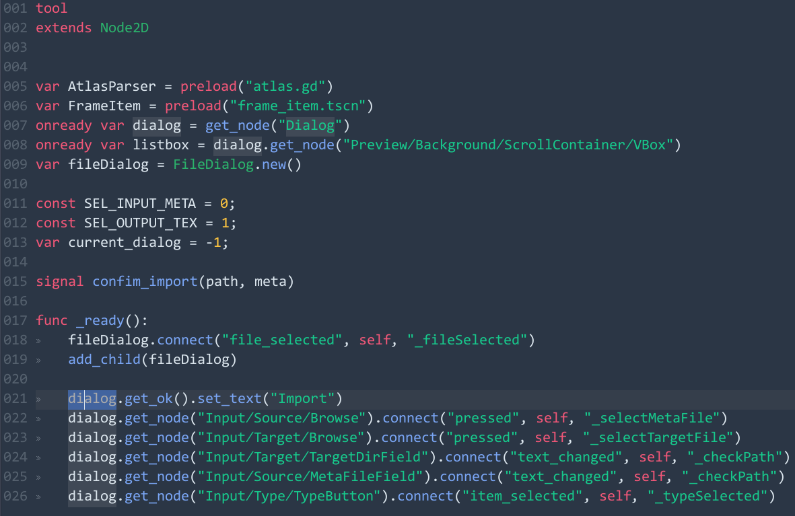
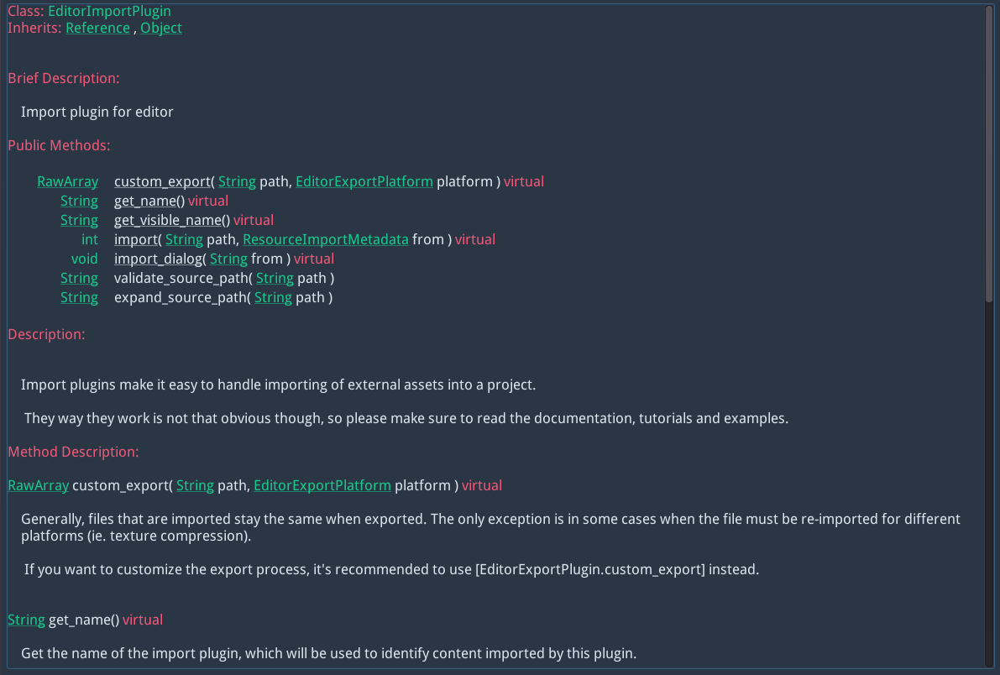
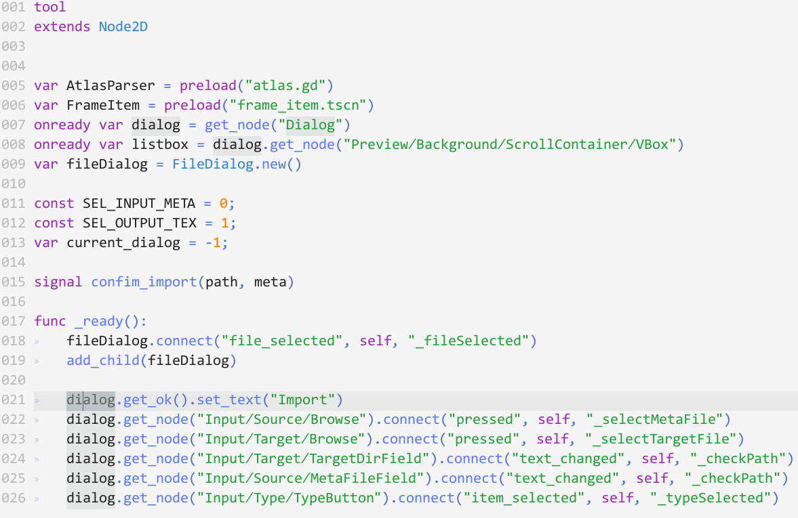
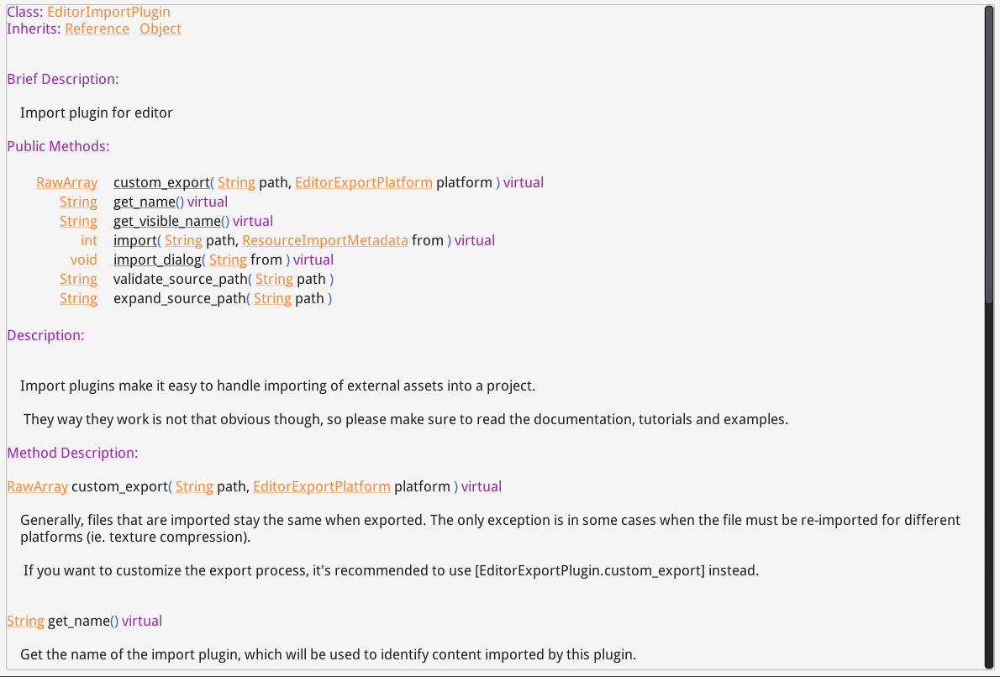
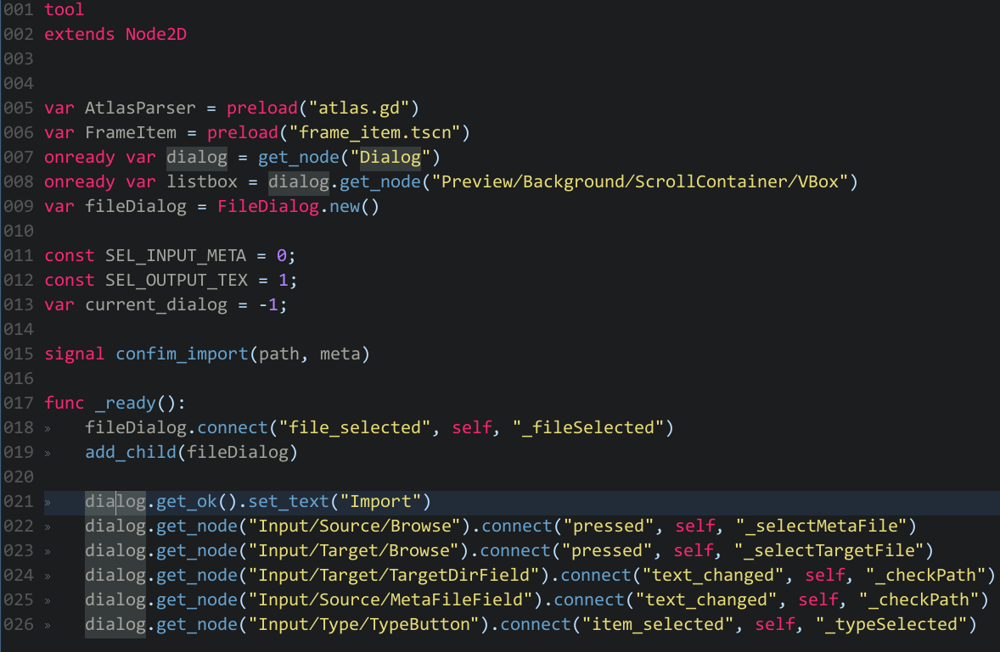
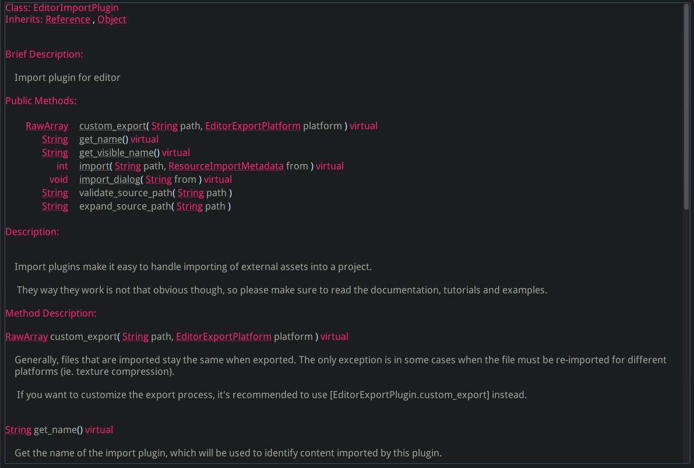

Color schemes for godot script editor and class reference viewer.

### How to use these color schemes?
Quit godot editor and replace settings to your `editor_settings.xml`.

---

### Chester

#### Google code light

### Monokai

